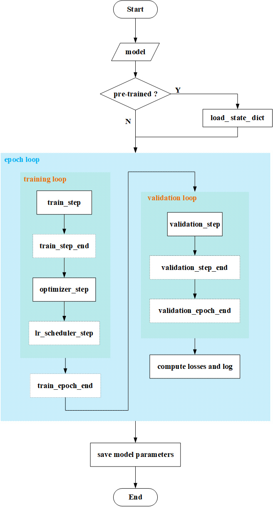

# Spatiotemporal-Prediction

    
    
    
    

You are looking at the repository for the spatiotemporal prediction neural networks. I override such great works with
PyTorch according the papers and the codes if the authors provide. Since I'm very 'vegetable', there are some latent
bugs hiding in the implements. So just think of twice while reading rather than be insatiable when get errors with the
direct copy.

## EnhancedModule and Trainer

The native codes for models and training processes may be tedious as we have to repeat some common blocks for each
model. Recently, the `PyTorch-Lightning` sounds great while the usage is a little hard to me. Therefore, I refer the
design idea of `PyTorch-Lightning` to design my own tool class: `EnhancedModule` and `Trainer`.

### EnhancedModule

This class inherits from `torch.nn.Module` with some additional aspect methods to custom the operation in training,
validation or test loop while the repeatable blocks are packaged in the `Trainer` class. The additional methods you may
need to override is shown as the following:

- `configure_optimizer`
- `configure_lr_scheduler`
- `training_step`
- `training_step_end`
- `training_epoch_end`
- `validation_step`
- `validation_step_end`
- `validation_epoch_end`
- `predict_step`

> See details in source code and examples.

### Trainer

The `Trainer` class just provide $2$ function: `fit` to train and valid dataset and `predict` to generate the outputs
by the convergent network. Specially, the main process in `fit` is shown below.

    

##         